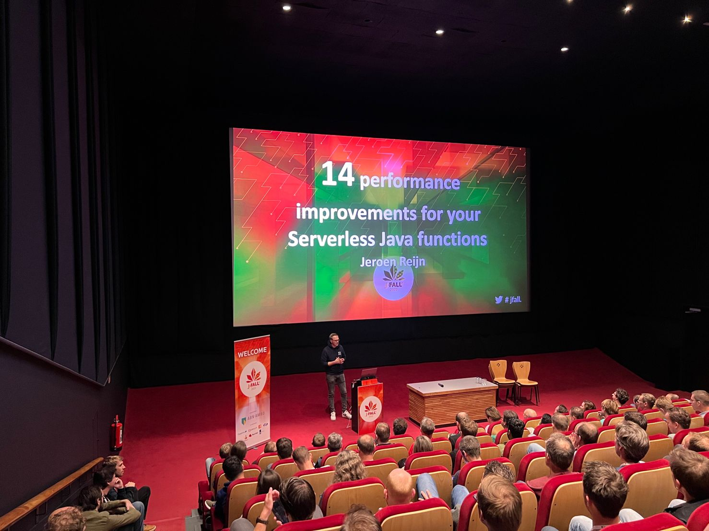
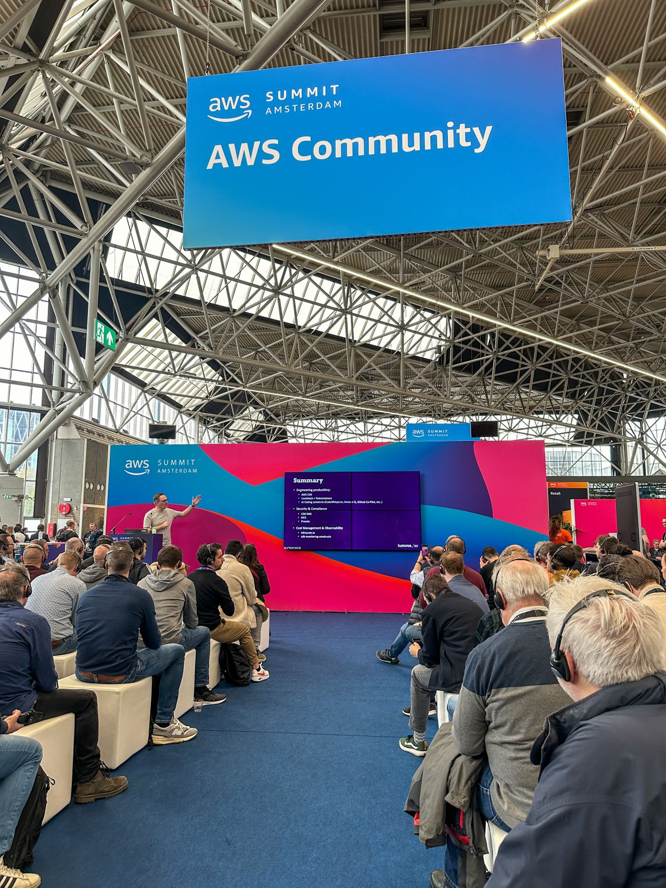
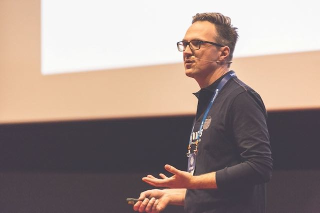
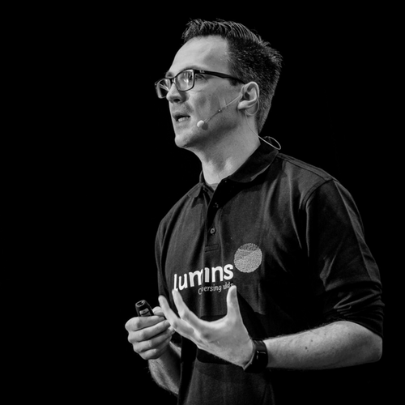

Hello 👋!

My name is Jeroen Reijn and this is my personal website. I'm an experienced Solutions Architect, specializing in AWS, Java, and cloud-native development. With a career spanning over two decades working on resilient, scalable, and mission-critical systems, I've worn many hats, including software engineer, consultant, trainer and software architect.

I work at [Luminis](https://www.luminis.eu) as a Cloud Solutions Architect, where I help customers benefit from Public Cloud Computing. I focus on AWS and due to sharing my experience on my blog, at meetups, and at conferences, I have been accepted into the [AWS Community Builder program](https://builder.aws.com/connect/community/community-builders) since August of 2022.


 
 


When I'm not architecting cloud solutions or sharing my expertise, you’ll find me experimenting with emerging technologies and contributing to open source.

## Public Talks 🎤

I like to share my experience and thoughts through public speaking and below are some of the events I’ve had the privilege to participate as a speaker.

### 2025
- [Production-ready Lambda functions with Lambda PowerTools](https://www.meetup.com/awsugnl/events/306912455/) - AWS User Group The Netherlands Meetup

### 2024

- [Accelerating the AWS Journey: (Open Source) Tools for getting teams up to speed](https://speakerdeck.com/jreijn/accelerating-the-aws-journey-open-source-tools-for-getting-teams-up-to-speed) - AWS Summit Amsterdam
- [Azure vs AWS: Battle of the Clouds](https://www.meetup.com/dutch-azure-meetup/events/300326315/) - Dutch Azure Meetup
- [Lessons Learned from Running Serverless Java Workloads in AWS Lambda](https://www.meetup.com/apeldoornjug/events/299653572/) - Apeldoorn JUG Meetup

### 2023
- [Accelerating Your AWS Journey: Open Source Tools for getting teams up to speed](https://speakerdeck.com/jreijn/accelerating-your-aws-journey-open-source-tools-for-getting-teams-up-to-speed) - [AWS Community Day NL](https://awscommunityday.nl)

### 2022
- [Ten ways to improve the performance of your Java based AWS Lambda functions](https://www.youtube.com/watch?v=2xGsmAwFs60) - [JFall](https://2022.jfall.nl/)

### 2019
- [What’s a Service Mesh and why do I need one?](https://www.slideshare.net/jreijn/whats-a-service-mesh-and-why-do-i-need-one) - [JFall](https://jfall.nl)
- [What a Service Mesh can do for your Microservices architecture](https://www.youtube.com/watch?v=-d34WQoIeVA) - [Luminis DevCon](https://devcon.luminis.eu)

### 2018
- [Test Driven Documentation for your REST(ful) service](https://www.slideshare.net/jreijn/testdriven-development-for-your-restful-service) - [Luminis DevCon](https://devcon.luminis.eu)

### 2017
- [Hoe releasen minder pijnlijk werd bij ANWB Alarmcentrale](https://www.slideshare.net/jreijn/hoe-releasen-minder-pijnlijk-werd-bij-de-anwb-alarmcentrale-79301666) - [Luminis DevCon](https://devcon.luminis.eu)

   

## Podcasts and videos 🎙️

- [Java Cloud Migrations](https://www.youtube.com/watch?v=6I8FTA8iiBw) - Java in the Cloud
- Wat is een Technisch geweten bij Luminis (in Dutch) - [Luminis Tech Talks](https://open.spotify.com/show/18c2MuauRakL1do0G06FCY?si=dad910770f3b4f60).
- [Cloud Engineering panel discussion](https://www.youtube.com/watch?v=nitdepIdhq0) - Club Cloud 2021
