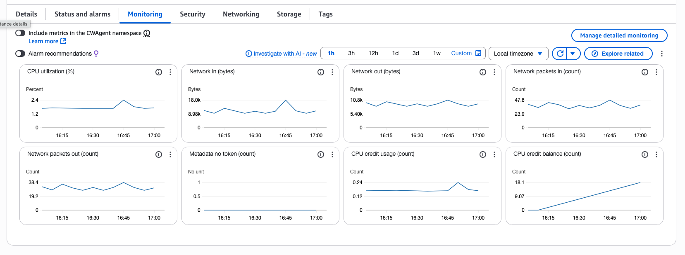
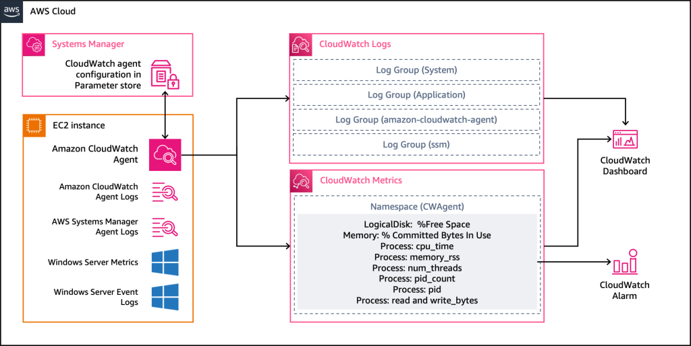
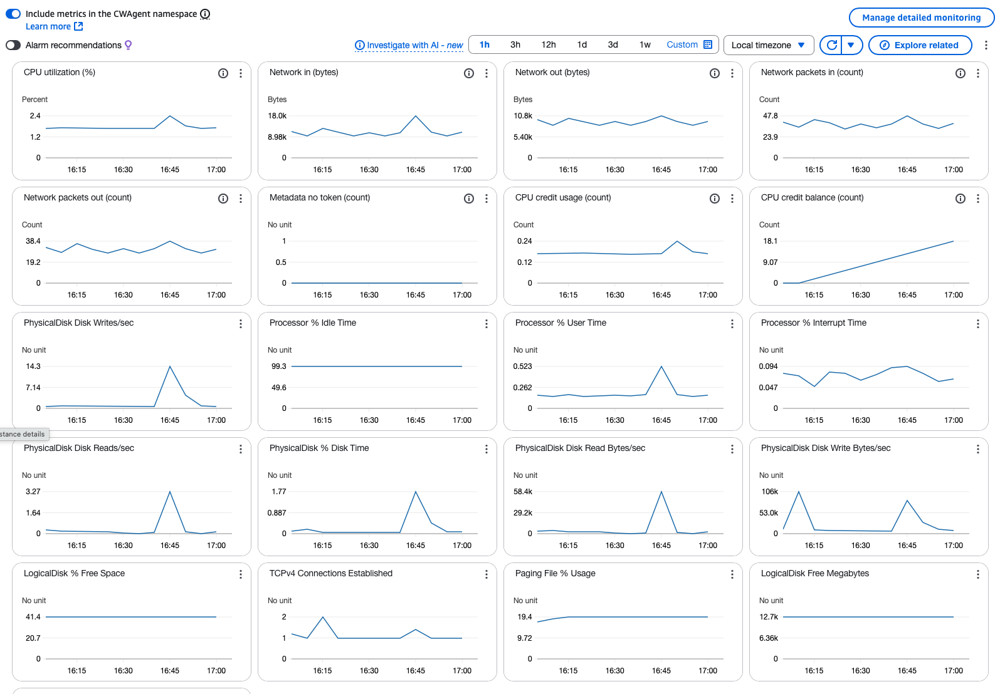
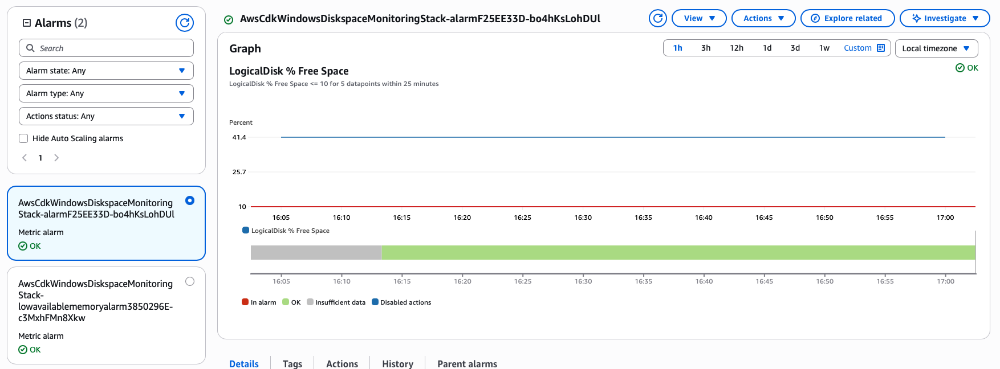

[Amazon CloudWatch](https://docs.aws.amazon.com/AmazonCloudWatch/latest/monitoring/WhatIsCloudWatch.html) monitors Windows EC2 instances out of the box, but only gives you basic host-level metrics like CPU and network usage. In this post, you'll learn how to extend observability with the Amazon CloudWatch Agent. We will use AWS CDK in TypeScript to automatically deploy an example instance with an installed and configured CloudWatch Agent.

## Default collected metrics

Elastic Compute Cloud (EC2) instances send [a set of predefined metrics](https://docs.aws.amazon.com/AWSEC2/latest/UserGuide/viewing_metrics_with_cloudwatch.html) to CloudWatch. Most of these metrics are system related and focus on CPU and Networking metrics. Under the monitoring tab in the AWS EC2 Console you can get a quick overview of some of out of the box available metrics for your EC2 instance.



It's a great starting set, but what if you need more? What if you need metrics from inside of the VM?

## Gathering additional metrics

If you need more system or application level metrics you can make use of the Amazon [CloudWatch Agent](https://docs.aws.amazon.com/AmazonCloudWatch/latest/monitoring/Install-CloudWatch-Agent.html). The CloudWatch agent is service which you can run on the EC2 instance and it's great for:

- Collecting system-level metrics (CPU, memory, disk, network)
- Gathering custom metrics from your application(s)
- Collecting and centralizing logs from various sources
- Monitoring both AWS and on-premises environments with a single tool

A high-level overview of the CloudWatch Agent and how it interacts with an EC2 instance and the CloudWatch service is shown in the following diagram.

[](https://aws.amazon.com/blogs/infrastructure-and-automation/collect-custom-metrics-with-amazon-cloudwatch-strategic-tagging/)

You can install the CloudWatch agent via EC2 user data, AWS Systems Manager, or via the AWS EC2 Console. In this post we will install the CloudWatch Agent and its configuration using the user data feature of an EC2 instance. Before we can actually install the agent, we first need to create a CloudWatch Agent configuration, which we can use later on during the installation.

## Create a CloudWatch Agent Configuration

The CloudWatch Agent configuration file is a JSON file with four sections:

- **agent** - includes fields for the overall configuration of the agent
- **metrics** - specifies the custom metrics for collection and publishing to CloudWatch
- **logs** - specifies what log files are published to CloudWatch Logs. This can include events from the Windows Event Log if the server runs Windows Server.
- **traces** - specifies the sources for traces that are collected and sent to AWS X-Ray

As you can see there is a lot you can do with the CloudWatch agent. However, in this post we will focus only on metrics.

Let's take a look at an example configuration:

```typescript
const cwAgentConfig = {
    agent: {
        metrics_collection_interval: 60
    },
    metrics: {
        namespace: "CWAgent",
        append_dimensions: {
            InstanceId: "\${aws:InstanceId}",
        },
        metrics_collected: {
            LogicalDisk: {
                measurement: [
                    {name: "% Free Space", unit: "Percent"},
                    {name: "Free Megabytes", unit: "Megabytes"},
                ],
                "resources": [
                    "*"
                ]
            },
            Memory: {
                metrics_collection_interval: 60,
                measurement: [
                    {"name": "% Committed Bytes in Use", "unit": "Percent"},
                ],
                "resources": [
                    "*"
                ]
            }
        }
    }
};
// Stringify the JSON
const configJson = JSON.stringify(cwAgentConfig);
```

In the above example configuration we specify that the CloudWatch Agent needs to collect metrics every 60 seconds. 
If you gather more than just metrics you can also specify collection intervals per section (metrics, logs, traces).

For clarity the namespace is explicitly set to **CWAgent**, but if you omit the namespace all metrics will be stored in the **CWAgent** namespace by default. You can of course set your own custom namespace.

For each collected metric an additional dimension is added for the *InstanceId*. When collecting metrics for EC2 instances you can also think of other dimensions like InstanceType, AutoScalingGroupName or ImageId which would reflect in the JSON as:

```json
"append_dimensions": {
    "InstanceId": "${aws:InstanceId}",
    "InstanceType": "${aws:InstanceType}",
    "AutoScalingGroupName": "${aws:AutoScalingGroupName}"
}
```

Looking at the metrics **metrics_collected** section you can see we want to collect metrics for the Windows Performance object _LogicalDisk_ and _Memory_. If you're doing this for the first time you might wonder what other performance objects and metrics are available. You can see the performance objects by running the following command on your Windows instance.

Powershell:

```powershell
Get-Counter -ListSet *
```

Command-line:

```plain
TypePerf.exe –q
```

Running one of the above command will return quite a list of performance objects and corresponding metrics.  You can expect to see all kinds of different objects. From SQL Server to Windows Events.

Now let's take a closer look at the measurement section in which the metrics are defined that we want to store. For each metrics you can explicitly specify a metric name and unit the metric needs to be stored as (Percentage, MegaBytes. etc). If you leave out the unit type the agent will try to pick the right one.

Due note that all metrics collected with the CloudWatch agent are considered custom metrics and are billed separately. A custom metric costs about $0.30 per metric per month (depending on your region), so **costs can add up quickly**.

## Storing the configuration in Systems Manager Parameter store

While implementing this I ran into all kinds of issues with the JSON format of the configuration file. Creating the JSON file in typescript, passing it to Powershell, writing it to disk, and reading the file took me multiple attempts to get right. An easier approach is to store the JSON configuration in Systems Manager Parameter Store and just pass the parameter when configuring the agent. 

```typescript
const cwAgentConfigParam = new StringParameter(this, 'cw-agent-config', {
    parameterName: '/ec2/cw-agent-config.json',
    stringValue: configJson
});
```

For the instance to be able to fetch the parameter we will need to make sure we set the proper IAM permissions for the instance role. Let's create a new IAM role and add the required permissions.

```typescript
const role = new Role(this, "instance-role", {
    assumedBy: new ServicePrincipal("ec2.amazonaws.com")
});

// required for the CloudWatch agent to send data to cloudwatch
role.addManagedPolicy(ManagedPolicy.fromAwsManagedPolicyName("CloudWatchAgentServerPolicy"));

// required for SSM to manage the instance
role.addManagedPolicy(ManagedPolicy.fromAwsManagedPolicyName("AmazonSSMManagedInstanceCore"));

// Don't forget to add the permissions to read the agent configuration parameter
cwAgentConfigParam.grantRead(role);
```

Now that we’ve configured IAM and stored our agent configuration, let’s create a Windows EC2 instance to attach and monitor.

## Creating a Windows Server EC2 instance

When creating a Windows instance in AWS CDK you will need to place the instance in one of the subnets of your VPC. Pick a specific Windows AMI like Windows Server 2022 and make sure to reference our IAM instance role, otherwise a default role is created without the proper permissions.

```typescript
// Create a Windows based EC2 instance
const instance = new Instance(this, "windows-demo-instance", {
    vpc: demoVpc,
    instanceType: InstanceType.of(InstanceClass.BURSTABLE3, InstanceSize.SMALL),
    machineImage: MachineImage.latestWindows(WindowsVersion.WINDOWS_SERVER_2022_ENGLISH_FULL_BASE),
    securityGroup: securityGroup,
    role: role,
    keyPair: keyPair,
    associatePublicIpAddress: false,
    vpcSubnets: {subnetType: SubnetType.PRIVATE_WITH_EGRESS},
    detailedMonitoring: true,
})

securityGroup.addIngressRule(Peer.anyIpv4(), Port.tcp(3389), "Allow RDP Connections")
```

Make sure to allow remote desktop access if you want to connect with remote desktop. I usually use the Systems manager Fleet manager to connect with Remote Desktop. Keep in mind that Amazon provided Windows AMI's have the Systems Manager Agent installed. If you use your own AMI you will need to make sure you install the Systems Manager agent yourself.

## Installing the CloudWatch Agent on deployment

As mentioned before in this post we will install the CloudWatch Agent, required for gathering our metrics, during the instance deployment by means of instance userdata. The latest version of the CloudWatch Agent is published by Amazon into an S3 bucket so all we need to do is request it and run the installer.

When starting the agent make sure you reference the configuration based on its SSM parameter name. We do so by specifying the `ssm:` prefix/protocol. The CloudWatch Agent, if given the permissions to fetch the parameter, will read the parameter from parameter store during startup 

```typescript
// Write config to disk and install agent
instance.userData.addCommands(
    // Install CW Agent via MSI
    `powershell.exe -Command "Invoke-WebRequest https://s3.amazonaws.com/amazoncloudwatch-agent/windows/amd64/latest/amazon-cloudwatch-agent.msi -OutFile C:\cwagent.msi"`,
    `msiexec /i C:\cwagent.msi /qn /l*v C:\cwagent-install.log`,
    // Wait for installation to complete
    `timeout /t 30`,
    // Start the agent with proper PowerShell execution
    `powershell.exe -ExecutionPolicy Bypass -Command "& 'C:\Program Files\Amazon\AmazonCloudWatchAgent\amazon-cloudwatch-agent-ctl.ps1' -a fetch-config -m ec2 -c ssm:${cwAgentConfigParam.parameterName} -s"`,
    // Wait for agent to start and load
    `timeout /t 30`,
    // check agent status
    `powershell.exe -ExecutionPolicy Bypass -Command "& 'C:\Program Files\Amazon\AmazonCloudWatchAgent\amazon-cloudwatch-agent-ctl.ps1' -a status -m ec2"`,
);
```

Once the deployment is finished you should be able to see more metrics in the monitoring tab for the EC2 instance. By default it will check if there are metrics within the CWAgent namespace and if so add them to the monitoring screen.



If the agent doesn’t publish your custom metrics, login with remote desktop and check the CloudWatch Agent log file `C:\ProgramData\Amazon\AmazonCloudWatchAgent\Logs\amazon-cloudwatch-agent.log` for errors. If the file is not there it might be the case the CloudWatch Agent isn't running, so you will need to troubleshoot that first.

## Creating CloudWatch Alarms for proactive monitoring

Adding metrics is great for trend analysis, but you really also want to have some alarms in place. Let's look at the scenario in case the disk is running out of space. Let's create an alarm for the "LogicalDisk % Free Space" metric.

```typescript
// Low diskspace alarm for C drive
let lowDiskSpaceCVolumeAlarm = new Alarm(this, 'alarm', {
    alarmDescription: 'This metric monitors the amount of free disk space on the instance. If the amount of free disk space falls below 10% for 5 minutes, the alarm will trigger',
    metric: new Metric({
        dimensionsMap: {
            InstanceId: instance.instanceId,
            objectname: "LogicalDisk",
            instance: "C:"
        },
        statistic: "Average",
        namespace: "CWAgent",
        metricName: "LogicalDisk % Free Space",
        unit: Unit.PERCENT,
    }),
    threshold: 10,
    evaluationPeriods: 5,
    datapointsToAlarm: 5,
    comparisonOperator: ComparisonOperator.LESS_THAN_OR_EQUAL_TO_THRESHOLD,
    treatMissingData: TreatMissingData.MISSING,
});
lowDiskSpaceCVolumeAlarm.addAlarmAction(new SnsAction(topic));
lowDiskSpaceCVolumeAlarm.addOkAction(new SnsAction(topic));
```

This should result in an alarm that's monitoring the amount of free disk space for the C: drive of our windows instance. It took me a couple of attempts to get the alarm working properly so it's good to validate your alarm dimensions and check the alarm in the AWS Console.



Now that the alarm is in place, CloudWatch will notify the subscribers of the SNS topic in case the alarm state is triggered.

## Summary

In this post, we explored how to create metrics and alarms for Windows based EC2 instances by leveraging the CloudWatch Agent and CloudWatch alarms. We've used AWS CDK for provisioning the infrastructure. Along the way, we covered some important topics like:

- CloudWatch agent configuration
- Windows Performance objects and metrics.
- CloudWatch alarms for custom metrics

With these pieces in place, you’ll have a setup that alerts your team when your Windows metrics exceed their threshold. Next, you could extend this setup with other instance metrics, application-level metrics and log collection.

A fully working CDK application with the code mentioned in this blogpost can be found in the [following GitHub repo](https://github.com/jreijn/demos-aws-cdk/tree/develop/aws-cdk-windows-diskspace-monitoring).
